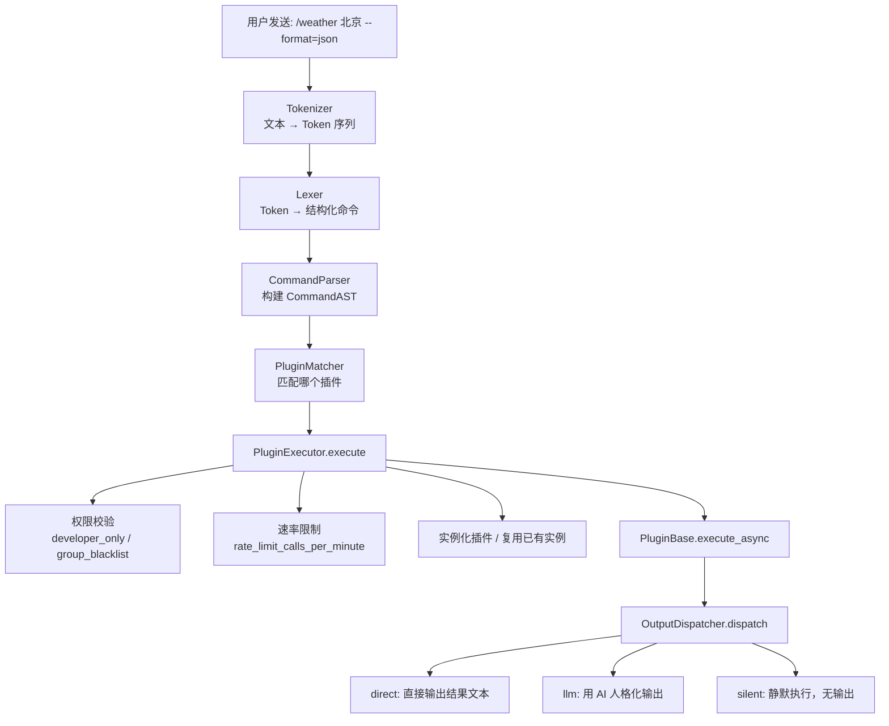

# 插件系统总览

插件（Plugin）是面向用户命令行的扩展机制。用户可以输入 `/` `#` `!` 等前缀命令，由插件响应。

## 工作原理



## 关键概念

### 指令前缀

默认支持三种前缀：

| 前缀 | 示例 |
|------|------|
| `/` | `/weather 北京` |
| `#` | `#骰子 6` |
| `!` | `!roll 2d6` |

### 渲染模式（RenderMode）

插件执行后的输出有三种展示方式：

| 模式 | 说明 | 适用场景 |
|------|------|------|
| `direct` | 直接输出原始文本，不做修改 | 格式化数据、查询结果 |
| `llm` | 结果传给 AI 做人格化润色 | 需要自然语言表达 |
| `silent` | 静默执行，不在聊天中显示 | 后台操作、副作用 |

### 参数匹配模式（PatternType）

| 模式 | 说明 | 示例 |
|------|------|------|
| `prefix` | 前缀精确匹配 | `/weather` 匹配 `/weather` |
| `keyword` | 关键词包含匹配 | `/天气` 中 "天气" 匹配 `/北京天气` |
| `regex` | 正则表达式匹配 | `/roll\s+\d+d\d+` 匹配 `/roll 2d6` |

### @command 装饰器

替代传统 `execute()` 方法的新范式：

```python
from sirius_pulse.plugins import PluginBase, command

class MyPlugin(PluginBase):
    @command(
        name="weather",
        prefix="/",
        patterns=["/weather"],
        description="查询天气",
        render_mode="llm",
    )
    async def handle_weather(self, city: str, format: str = "text"):
        # 自动从 CommandAST 提取 city 和 format
        ...
```

### 定时触发（Schedule）

从 v1.3 开始，插件可以通过声明式类属性 `_plugin_schedule` 定义定时任务，系统会自动将其转换为定时事件，无需手动编写事件循环：

| 字段 | 类型 | 说明 |
|------|------|------|
| `time` | `str` | 每天触发的时间，格式 `HH:MM`（24h） |
| `duration` | `int` | 触发窗口时长（分钟），默认 1440（全天） |

示例：

```python
class ReminderPlugin(PluginBase):
    _plugin_schedule = [
        {"time": "08:00", "duration": 1440},   # 每天 08:00 触发，触发窗口一天
        {"time": "12:00", "duration": 60},     # 每天 12:00 触发，窗口 1 小时
    ]
    # 其余插件逻辑...
```

声明后，`PluginDefinition.from_class()` 会将每个条目自动转换为 `PluginEventDef`（类型 `timer.schedule`），与通过 `_plugin_events` 手动定义的事件合并。定时调度会在插件加载时注册到后台调度器。

## 系统架构

```mermaid
flowchart TB
    A[CommandAST<br>结构化命令数据] --> B[PluginRegistry<br>多维度索引]
    A --> C[PluginLoader<br>加载器]
    A --> D[PluginExecutor<br>执行器]
    A --> E[OutputDispatcher<br>输出调度]
    A --> F[PluginConfigManager<br>配置管理]

    B --> B1["_commands_index:<br>(pattern, type, plugin, cmd_meta)"]
    B --> B2["_events_index:<br>[PluginDefinition]"]
    B --> B3["match_message(text)<br>→ MatchResult"]

    C --> C1[扫描 plugins/ 目录]
    C --> C2[import_plugin_class<br>找到 PluginBase 子类]
    C --> C3["PluginDefinition.from_class()<br>构建定义，含 _plugin_schedule → 定时事件"]
    C --> C4["安装依赖<br>AST 解析 _plugin_dependencies"]

    D --> D1["权限校验<br>_check_permissions"]
    D --> D2["速率限制<br>_check_rate_limit"]
    D --> D3["PluginContext.create<br>engine, adapter, ..."]
    D --> D4["PluginBase.execute_async<br>cmd"]
    D --> D5[超时保护]

    E --> E1["direct<br>直接输出"]
    E --> E2["llm<br>engine.brain.generate_text()"]
    E --> E3["silent<br>无输出"]

    F --> F1[启用/禁用]
    F --> F2[权限配置]
    F --> F3[热重载]
```



## 与技能的对比

| | 插件 | 技能 |
|---|---|---|
| **调用者** | 用户显式命令 | AI 自主决定 |
| **语法** | `/command args` | `[SKILL_CALL: ...]` |
| **触发方式** | 文本模式匹配 / 定时调度 | LLM 意图驱动 |
| **开发范式** | 继承 PluginBase + @command / _plugin_schedule | 函数 + SKILL_META |
| **输出** | direct / llm / silent | 注入 LLM 上下文 |
| **权限** | 细粒度（群黑名单、速率限制） | developer_only 标记 |
| **适用** | 固定功能、快速命令 / 定时任务 | AI 辅助工具调用 |

## 下一步

- [编写自定义插件](./plugin-authoring) — 从零创建一个插件
- [指令系统详解](./plugin-command) — Tokenizer → Lexer → Parser 完整链路
- [生命周期与上下文](./plugin-lifecycle) — PluginContext、EngineProxy、数据持久化