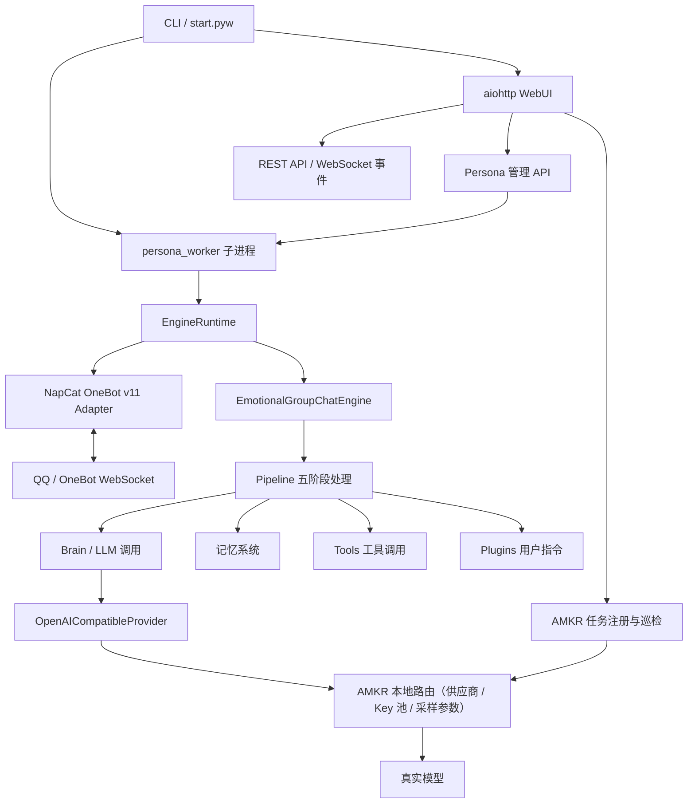

# 系统架构全景

Sirius Pulse 由 CLI、WebUI、人格子进程、平台适配器、对话引擎、AMKR 接入层、记忆、Tools 和 Plugins 组成。所有模型调用统一发往外部的本地 AMKR 服务。

## 进程模型

- WebUI 是管理进程，负责配置、状态、日志、API 和静态页面。
- 每个人格作为独立子进程运行，入口是 `sirius_pulse.persona_worker`。
- 人格进程内部由 `EngineRuntime` 创建引擎和平台适配器。

## 核心边界

| 目录 | 职责 |
|---|---|
| `sirius_pulse/core/` | 对话引擎、管线、Prompt、事件、回复策略、持久化与后台任务。 |
| `sirius_pulse/providers/` | 唯一的 LLM 边界：`OpenAICompatibleProvider` 指向 AMKR，`amkr.py` 解析连接配置，`amkr_sync.py` 注册任务名。没有厂商实现与本地路由注册表。 |
| `sirius_pulse/platforms/` | 具体平台适配器，目前包含 NapCat OneBot v11。 |
| `sirius_pulse/adapters/` | 平台无关消息模型和基础适配器抽象。 |
| `sirius_pulse/memory/` | 基础记忆、语义画像、日记、记忆单元、术语和用户档案。 |
| `sirius_pulse/tools/` | 模型可调用工具，支持内置与外部 Tool。 |
| `sirius_pulse/plugins/` | 用户显式触发的聊天指令、事件和调度。 |
| `sirius_pulse/webui/` | aiohttp API、静态前端、WebSocket 事件和管理逻辑。 |
