# 系统架构全景

> **v1.2 多人格架构的真实执行路径与模块边界**
>
> 本文档用人类易读的方式，从"一条消息怎么被处理"到"整个系统怎么运转"，完整描述 Sirius Pulse 的架构。流程图使用 Mermaid 语法。

---

## 第一章：系统全景图

### 1.1 你在看什么

Sirius Pulse 是一个**支持多人格启用的异步角色扮演程序**。想象一个 QQ 群里同时有几个不同的 AI 角色在聊天——有的活泼、有的高冷、有的毒舌——每个人格独立运行、独立记忆、独立配置。

### 1.2 进程模型

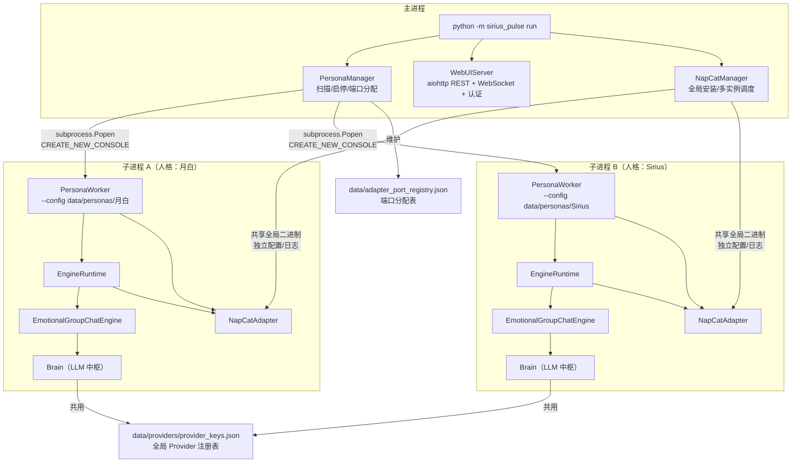

### 1.3 关键设计决策

| 决策 | 说明 |
|------|------|
| **独立子进程** | 每个人格一个独立进程，崩溃不影响其他人格 |
| **数据隔离** | 每个人格有自己的目录 `data/personas/{name}/`，记忆、配置、日志完全隔离 |
| **Brain 统一调用** | 所有人格共用 `provider_keys.json`，但各自有独立的 Brain 实例，LLM 调用总是通过 Brain 完成，不再散落各处 |
| **chat 串行，raw 并行** | `chat()` 通道串行化保证消息顺序；`raw_call()` 通道不受限，可与 chat 并行 |
| **NapCat 多实例** | 每个人格独立的 QQ 实例，共享全局二进制，独立配置和日志 |
| **端口自动分配** | `PersonaManager` 从 3001 开始递增分配 WebSocket 端口 |
| **内存+持久化双写** | 每次记忆写入 `basic_memory`（内存窗口）后自动同步到 `basic_store`（持久化存储），确保重启后上下文不丢失 |

---

## 第二章：主进程启动流程

### 2.1 从命令行到运行

```bash
python -m sirius_pulse run
```

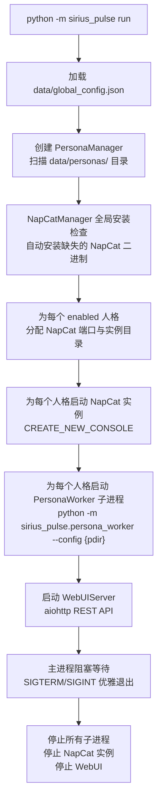

### 2.2 主进程三大组件

**PersonaManager（人格管家）**
- `create_persona(name)` — 创建新人格目录和默认配置
- `start_persona(name)` — 启动单个人格（含 NapCat 自动管理）
- `run_all()` — 批量启动所有 enabled 人格
- `get_logs(name)` — 读取子进程日志
- `get_status(name)` — 读取子进程心跳状态

**WebUIServer（管理面板）**
- 提供 REST API：人格列表、状态、配置、日志、监控
- 提供 WebSocket 事件推送：实时接收引擎事件
- 提供 JWT 认证：admin/viewer 角色权限控制
- 提供静态页面：Dashboard + 配置面板 + 监控页面
- 不直接操作 NapCat 进程，只通过 API 与 PersonaManager 交互
- 保存 Provider 配置后自动通知所有运行中的人格外进程热重载 provider 配置；WebUI 的存储相关 API 以只读模式打开数据库，避免与引擎写操作产生锁冲突
- 提供用户别名管理 API（添加、删除、shadow 标记），别名数据直接持久化在 `memory.db` 的 `aliases` 表，管理操作不再依赖演化链中间缓存。

**NapCatManager（QQ 管理器）**
- 管理 NapCat 全局二进制（安装、更新）
- 为每个人格创建独立实例目录
- 启动/停止 NapCat 进程

---

## 第三章：人格子进程启动流程

### 3.1 子进程内部发生了什么

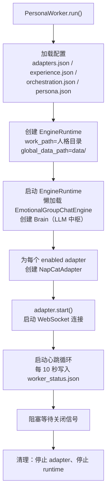

### 3.2 子进程内的关键协作

- 所有 bridge 共享同一个 `EngineRuntime` 和同一个 Brain 实例
- 每个 bridge 有自己的 `allowed_group_ids` 配置
- engine 的 `_pending_reminders` 是共享的（所有 bridge 都能投递提醒）
- Brain 是单例的，`chat()` 串行执行，`raw_call()` 可与 chat 并行
- **Brain system prompt 变更**：v1.3 起，Brain 的默认 pre‑hook 不再自动拼接 `memory_spec` 部分。构建系统提示时，将由 `PromptFactory.assemble_chat()` 等上层调用负责组装客户化记忆相关指令。如需自定义记忆策略，请通过 `build_system_prompt()` 或在配置中调整。
- **IdentityResolver 增强解析**：`IdentityResolver` 新增 `resolve_with_alias()` 方法，支持四层解析链（精确平台ID→Bot自识别→别名精确→模糊匹配），返回值含置信度和来源，用于开发者判断和用户解析。
- 引擎支持配置文件热重载，通过写入 `engine_state/reload_requested` 标志文件触发，支持类型：`persona`、`orchestration`、`experience`、`provider`、`all`。其中 `provider` 类型会重新构建 Provider 实例，使 provider 配置变更无需重启引擎。

---

## 第四章：消息处理完整流程

### 4.1 一条消息的一生

假设群里有人发了一条消息："今天工作好累"，看看它怎么被处理。

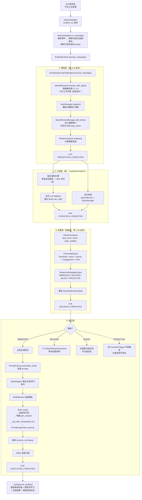

> **新增持久化说明**：在 `BasicMemoryManager.add_entry()` 步骤中，消息不仅被加入内存窗口（最近 30 条），还会通过 `engine.basic_store.append()` 持久化到磁盘。这意味着即使引擎重启，基本记忆仍然可以恢复，对话上下文不会丢失。此持久化同样适用于 AI 回复记录和 SKILL 执行结果。
>
> **纯表情包回复的记忆记录**：当 AI 使用 `send_sticker` 工具发送表情包时，引擎会将使用的表情包名称（最多 3 个）记录到基本记忆中（如 `[STICKERS: 猫猫.jpg, 狗狗.jpg]`），确保纯表情包回复不会丢失。v1.4 起，表情包发送不再通过文本标记，改为工具调用。
>
> **标签记录（用户消息）**：在处理用户消息时，引擎会提取其中的多模态输入（图片、动画表情等）并生成对应的 `tags` 添加到基本记忆中。例如，动画表情产生 `{ "type": "sticker", "label": "动画表情 ×2" }`，普通图片产生 `{ "type": "image", "label": "图片 ×3" }`。这些标签可用于后续检索和统计。
>
> **标签记录（AI 回复）**：AI 回复中的表情包和钉住/取消钉住操作也会以 `tags` 形式记录，例如 `{ "type": "sticker", "label": "表情包: 猫猫.jpg, 狗狗.jpg" }` 或 `{ "type": "pin", "label": "钉住 ×1" }`。v1.4 起，钉住/取消钉住通过 `pin_message` / `unpin_message` 工具实现，不再写入文本标记。
>
> ~~**完整 LLM 消息链记录**：每次 AI 回复生成后（包括立即回复和延迟回复），引擎会将本次对话的完整 LLM 消息链（包含 system prompt 和所有用户/助手交替消息）作为 `conversation_chain` 字段保存到 `BasicMemoryEntry` 中。这为后续检索、调试和上下文重建提供了精确的输入记录，提升了记忆回溯的准确性。~~
>
> **v1.3 变更**：该功能已移除。自动记忆记录和回复时间戳追踪（`_last_reply_at`）不再通过 Brain post‑hooks 执行。延迟回复的记忆写入与去重逻辑已统一由 Brain post‑hooks 处理（见 `_hook_stickers`、`_hook_dedup`、`_hook_pin_messages` 等），因此不再单独保存完整 LLM 消息链。如需保留上下文记录，建议通过 `BasicMemoryManager.add_entry()` 手动写入。

> **插件命令快速拦截**：引擎新增插件命令拦截机制。在感知层完成消息记录后、认知层进行 LLM 或规则分析之前，引擎会检查消息内容是否匹配已注册的插件命令（如 `/ca analyse`）。若匹配，则直接执行插件逻辑并返回结果，避免了 LLM 对命令模式的错误理解。此步骤完全基于规则，零 LLM 成本，确保插件命令的及时响应。
>
> **引用消息解析**：NapCatAdapter 在解析消息段时，新增引用消息（reply 类型）的处理。当检测到回复段时，Adapter 会通过 NapCat API `get_msg` 获取被引用消息的内容和发送者信息，并将其格式化为 `[引用消息 msg_id="xxx" speaker="张三"] 内容 [/引用消息]` 注入到 prompt 中。这确保了 AI 在生成回复时能理解回复的上下文。此步骤完全基于规则，零 LLM 成本。

### 4.2 认知层内部细节

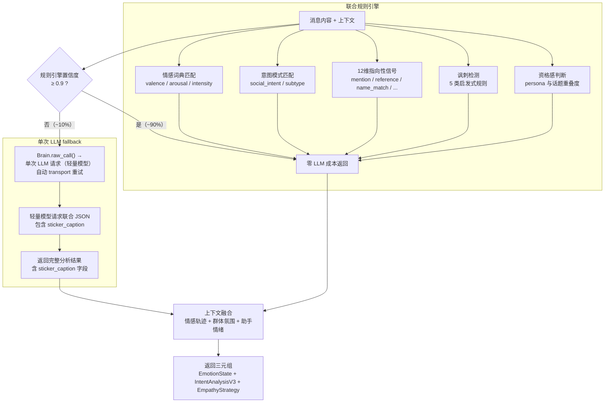

### 4.3 延迟回复的触发

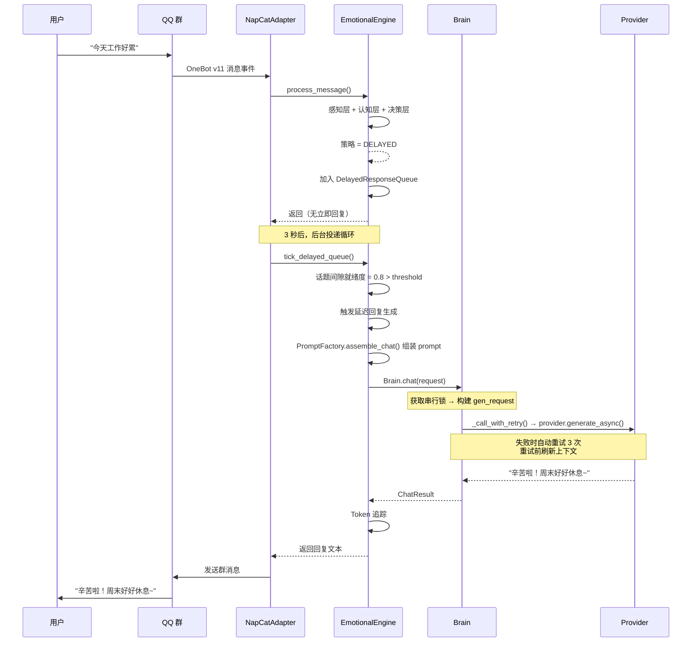

> **搜索内容优化**：延迟回复在构建上下文时，`search_query` 使用去除 XML 标签的原始聊天内容，避免标签干扰日记检索的准确性。
>
> **v1.3 Hook 统一处理**：延迟回复的最终回复处理（表情包解析、去重、记忆记录、时间戳更新）已全部移入 `Brain` 的 post‑hooks，不再由 `DelayedQueueTasks` 内部手动管理。因此 `delayed_response_queue` 中的 `sticker_names`、`clean_text` 等字段直接依赖 `ChatResult` 中 hook 处理后的结果。
>
> **v1.5 流程控制工具**：延迟回复生成中，AI 可以通过 `continue` 和 `stop` 工具控制回复的流程。`continue` 表示当前文本已发送，继续生成下一条消息；`stop` 表示结束本轮回复。这些工具被注册为 `extra_tools` 传递给 `Brain.chat()`，使 AI 能够在单轮延迟回复中发送多条消息或按需停止。流程控制工具的调用不影响正常的技能执行。
>
> **统一消息标签**：v1.4 起，所有 `<message>` XML 标签统一通过 `PromptFactory.tag_message()` 生成，保证格式一致。新增 `platform_message_id` 参数，用于缓存一致性和引用回复，该参数在延迟队列、即时回复、上下文组装中均会传递。

### 4.4 四种响应策略的触发条件

| 策略 | 触发场景 | 行为 |
|------|---------|------|
| **IMMEDIATE** | 被 @、紧急求助、高 relevance | 立即生成并发送回复 |
| **DELAYED** | 一般性对话、话题间隙不够 | 加入队列，等自然间隙再回 |
| **SILENT** | 无关话题、低 relevance、冷却中 | 不回复，只后台学习 |
| **PROACTIVE** | 群聊沉默过久、记忆触发、情感触发 | 主动发起新话题 |

---

## 第五章：后台任务系统

### 5.1 引擎后台任务

引擎内置 8 个后台任务，另有被动 SKILL 注册的任务（如 reminder）并行运行：

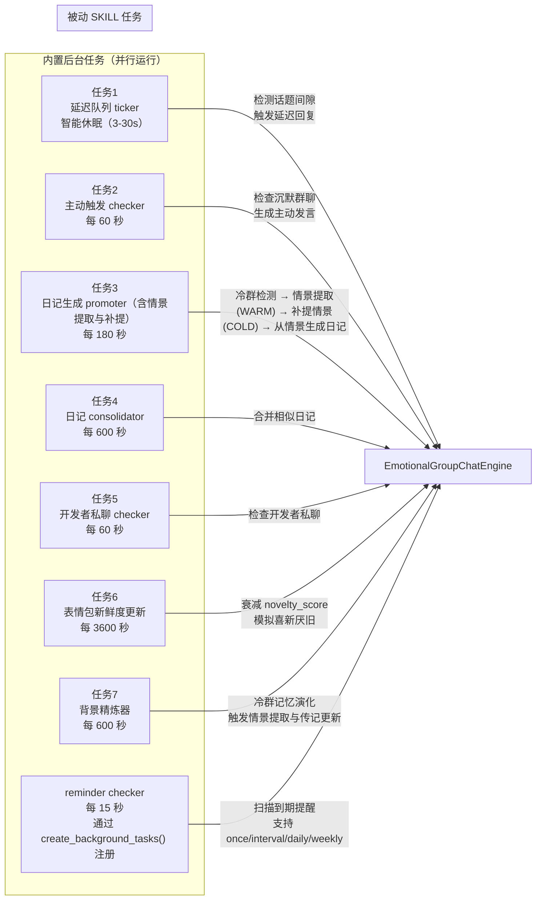

### 5.2 提醒系统完整链路

提醒是一个**双模式 SKILL**：主动模式由模型调用 `run()` 创建/管理提醒，被动模式通过 `create_background_tasks(ctx)` 注册周期性检查任务。

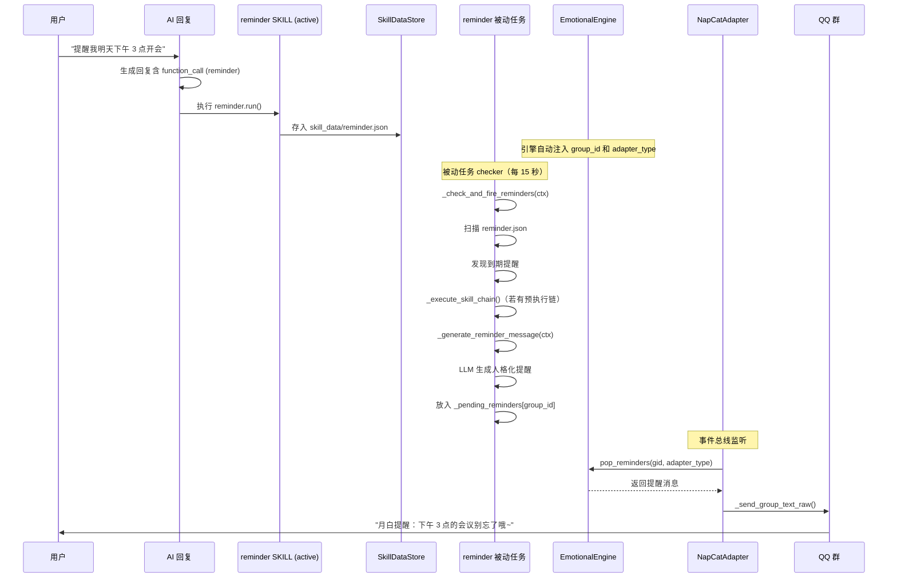

---

## 第六章：数据流与存储

### 6.1 全局共享数据

| 路径 | 说明 | 谁读写 |
|------|------|--------|
| `data/global_config.json` | WebUI 参数、NapCat 管理、日志级别 | 主进程读写 |
| `data/providers/provider_keys.json` | Provider 凭证（所有人格共用） | 主进程/子进程读 |
| `data/adapter_port_registry.json` | NapCat 端口分配表 | PersonaManager 维护 |

### 6.2 人格隔离数据

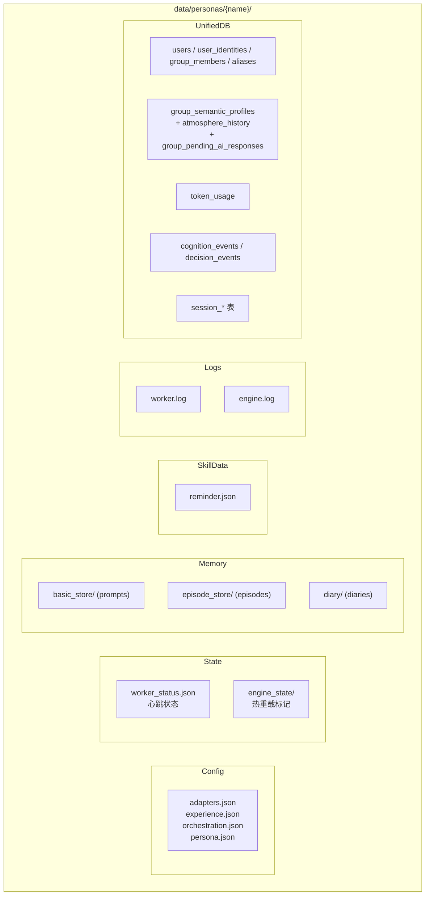

**统一数据库说明**：原来存储于独立 `memory.db`、`token_usage.db`、`cognition_events.db` 和各会话目录下 `session_state.db` 的数据，现已全部合并到统一的 `persona.db` 中。`group_semantic_profiles` 表新增了 `group_name`、`interest_topics`、`group_norms`、`taboo_topics`、`dominant_topic` 字段以支持更丰富的群体画像。新增 `atmosphere_history` 表和 `group_pending_ai_responses` 表分别记录群体氛围历史与 AI 待回复记录。     C1["persona.json<br/>人格定义"]
        C2["orchestration.json<br/>模型编排"]
        C3["adapters.json<br/>平台适配器"]
        C4["experience.json<br/>体验参数"]
    end

    subgraph State
        S1["engine_state/persona.json<br/>运行时人格状态"]
        S2["engine_state/worker_status.json<br/>子进程心跳"]
        S3["engine_state/enabled<br/>启停标志"]
        S4["engine_state/reload_requested<br/>热重载请求标志"]
    end

    subgraph Memory
        M1["memory/basic/<group_id>.jsonl<br/>基础记忆（30条内存窗口）"]
        M2["memory/diary/<group_id>.jsonl<br/>日记记忆"]
        M3["memory/diary/index/<group_id>.json<br/>日记索引"]
        M4["memory/glossary/terms.json<br/>名词解释（人格级隔离）"]
        M5["memory/semantic/<br/>群语义画像"]
        M6["memory/basic_store/<group_id>.jsonl<br/>持久化基础记忆（所有条目）"]
    end

    subgraph SkillData
        SD1["skill_data/reminder.json<br/>提醒数据"]
        SD2["skill_data/*.json<br/>其他 SKILL 数据"]
        SD3["skill_data/stickers/<br/>表情包 RAG 库"]
    end

    subgraph Logs
        L1["logs/worker.log<br/>子进程主日志"]
        L2["logs/archive/<br/>归档日志"]
    end
```

> **记忆持久化机制**：`basic_memory`（内存窗口）保留最近 30 条消息，用于对话上下文；每次调用 `add_entry` 后，引擎会自动调用 `basic_store.append()` 将相同条目写入 `memory/basic_store/` 下的独立 JSONL 文件。这样即使引擎重启，也可以通过 `basic_store` 恢复完整的对话历史。此机制适用于用户消息、AI 回复、SKILL 执行结果等所有需要写入记忆的文本。

### 6.3 NapCat 多实例数据

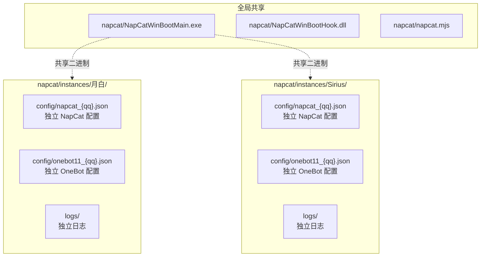

---

## 第七章：事件总线

引擎在处理每条消息时发射事件，外部可以订阅：

```python
from sirius_pulse.core.events import SessionEventType

async for event in engine.event_bus.subscribe():
    if event.type == SessionEventType.PERCEPTION_COMPLETED:
        print(f"感知完成：{event.data['group_id']}")
    elif event.type == SessionEventType.COGNITION_COMPLETED:
        print(f"认知完成：情绪={event.data['emotion']}")
    elif event.type == SessionEventType.DECISION_COMPLETED:
        print(f"决策完成：策略={event.data['strategy']}")
    elif event.type == SessionEventType.EXECUTION_COMPLETED:
        print(f"执行完成：回复={event.data['reply']}")
```

**事件类型**：

| 事件 | 触发时机 | 数据 |
|------|---------|------|
| `PERCEPTION_COMPLETED` | 感知层完成后 | group_id, user_id, message |
| `COGNITION_COMPLETED` | 认知层完成后 | emotion, intent, empathy |
| `DECISION_COMPLETED` | 决策层完成后 | strategy, threshold |
| `EXECUTION_COMPLETED` | 执行层完成后 | reply, tokens_used |
| `DELAYED_RESPONSE_TRIGGERED` | 延迟回复触发时 | group_id, original_message |
| `PROACTIVE_RESPONSE_TRIGGERED` | 主动发言触发时 | group_id, trigger_type |
| `DEVELOPER_CHAT_TRIGGERED` | 开发者私聊主动对话触发时 | group_id, chat_content |
| `REMINDER_TRIGGERED` | 提醒到期时 | group_id, reminder_content |

**有损广播**：如果消费者处理慢了，队列满后事件会被丢弃，不会阻塞引擎。

---

## 第八章：Brain — LLM 调用中枢

### 8.1 为什么需要 Brain

以前每个需要调用 LLM 的模块各自处理：认知分析直接调 provider，回复生成也直接调 provider，日记生成自己处理重试……导致每个调用方各自写 try/except、各自处理重试逻辑、各有各的失败兜底。

Brain 将所有 LLM 调用统一到一处，提供两条通道：

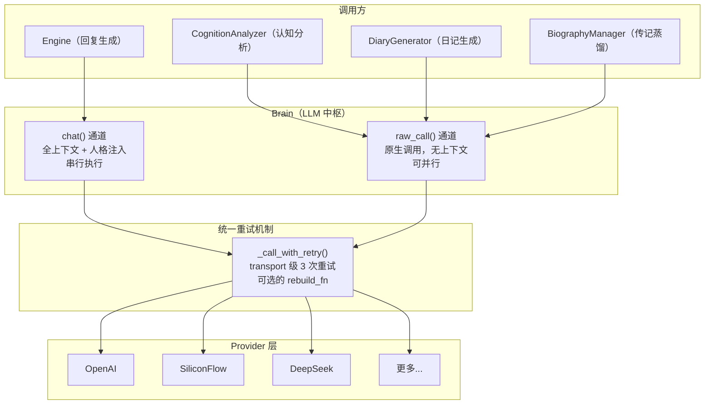

### 8.2 两条通道的对比

| 维度 | `chat()` | `raw_call()` |
|------|----------|-------------|
| **用途** | 回复生成、主动发言、插件风格化 | 认知分析、日记生成、传记蒸馏 |
| **人格注入** | ✅ 自动注入人格设定 | ❌ 不注入，需调用方自己处理 |
| **上下文组装** | ✅ pre-hooks 链拉取最新消息 | ❌ 只发送调用方传过来的消息 |
| **串行锁** | ✅ `asyncio.Lock`，保证消息顺序 | ❌ 无锁，可随意并行 |
| **重试** | ✅ transport 级 + rebuild_fn 刷新上下文 | ✅ transport 级（无 rebuild_fn） |
| **后处理** | ✅ post-hooks 链（去重、表情包、记忆记录） | ❌ 只做 token 统计 |

### 8.3 chat() 执行流程详解

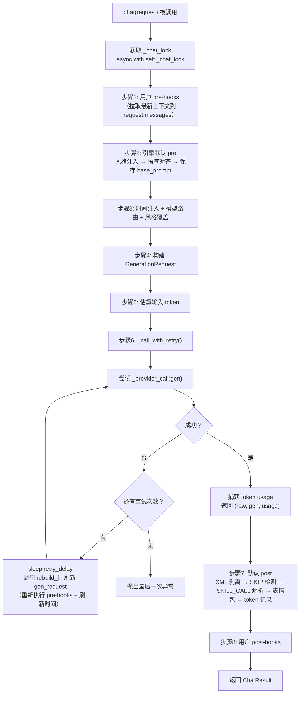

### 8.4 串行锁的影响

`chat()` 使用 `asyncio.Lock` 保证同一时刻只有一个 chat 调用在运行：

```
事件循环时间线：
  消息 A 到达 → chat(A) → 获取锁 → 构建 prompt → await HTTP → 后处理 → 释放锁
                          ↓ 等待
  消息 B 到达 → chat(B) → 获取锁 → ...

  raw_call(X) → 无锁，可随时执行
```

这意味两条群消息的回复顺序与接收顺序一致。但 `raw_call()` 不受限——认知分析的 LLM fallback 可以和 chat 的回复生成同时进行。

### 8.5 重试机制

所有 LLM 调用都经过 `_call_with_retry()`，提供统一的 transport 级重试：

**默认重试参数**（`RawRequest` / `ChatRequest` 中可覆盖）：

```python
retry_max: int = 2        # 总调用次数 = retry_max + 1 = 3
retry_delay: float = 2.0  # 重试间隔（秒）
```

**两种重试场景的行为对比：**

| 失败类型 | 触发条件 | 重试行为 |
|---------|---------|---------|
| **transport 失败** | 网络超时、连接断开、5xx | 调用 `_call_with_retry`，3 次后抛异常 |
| **JSON 解析失败**（仅部分调用方） | LLM 返回了不合法的 JSON | 调用方自己处理（如 generator 修改 prompt 再试） |

**chat() 的上下文刷新（rebuild_fn）**：

每次 transport 重试前，`chat()` 会调用 `_rebuild_gen_request()`：
1. 重新执行 pre-hooks（拉取最新的群聊消息到 `request.messages`）
2. 刷新当前时间字符串
3. 用 `base_system_prompt` + 新时间 + 更新的消息重建 `GenerationRequest`

确保重试发出去的 prompt 不会落后于群聊进度。

### 8.6 Token 用量的准确记录

```python
# _call_with_retry 内部：
raw = await self._provider_call(current)
real_usage = get_last_generation_usage()  # 立即捕获，无 await 点
return raw, current, real_usage
```

token 用量在 provider 返回后**立即捕获**（两个语句之间没有 `await`），然后通过返回值传递到 `_record_chat_tokens()`。不会出现两个协程间 token 统计串号的问题。

### 8.7 Brain 的并发安全性

| 维度 | 状态 | 原因 |
|------|------|------|
| 不会崩溃 | ✅ | 无任何竞态条件会导致程序崩溃 |
| token 统计准确 | ✅ | 在无 await 点处捕获 usage，通过参数传递 |
| chat 顺序保证 | ✅ | `asyncio.Lock` 串行化 |
| 内存安全 | ✅ | 无共享可变状态的深度修改 |
| chat 与 raw 并行 | ✅ | raw_call 不受锁影响 |

---

## 第九章：Provider 路由

### 9.1 支持的 Provider 平台

| 平台 | 标识 | 默认 base_url |
|------|------|--------------|
| OpenAI 兼容 | `openai-compatible` | https://api.openai.com |
| 阿里云百炼 | `aliyun-bailian` | https://dashscope.aliyuncs.com/compatible-mode |
| 智谱 AI | `bigmodel` | https://open.bigmodel.cn/api/paas/v4 |
| DeepSeek | `deepseek` | https://api.deepseek.com |
| SiliconFlow | `siliconflow` | https://api.siliconflow.cn |
| 火山方舟 | `volcengine-ark` | https://ark.cn-beijing.volces.com/api/v3 |
| YTea | `ytea` | https://api.ytea.top |

### 9.2 路由规则

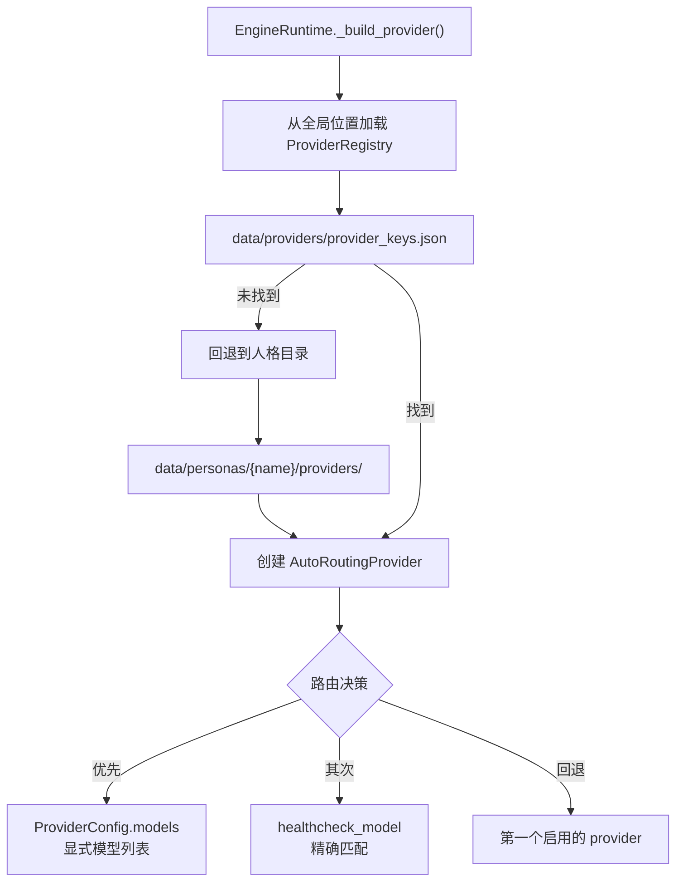

---

## 第十章：模块职责速查表

| 分层 | 模块 | 主要职责 |
|------|------|---------|
| **入口层** | `main.py` | 统一 CLI：无参数启动 WebUI；`run` 启动所有人格；`persona` 管理单个人格 |
| **主进程管理** | `persona_manager.py` | 多人格生命周期：扫描、创建、删除、迁移、启停、监控 |
| **子进程入口** | `persona_worker.py` | 单个人格运行入口：加载配置、创建 EngineRuntime、启动 Bridge、心跳 |
| **子进程运行时** | `platforms/runtime.py` | EngineRuntime：懒加载引擎，管理 Brain 和 bridge |
| **LLM 核心中枢** | `core/brain.py` | **统一 LLM 入口**：`chat()`（串行 + 人格注入 + 上下文）和 `raw_call()`（并行 + 纯原生）双通道；内置 transport 级重试（`_call_with_retry`）；post-hooks 链；token 用量记录 |
| **平台适配** | `platforms/onebot_v11/napcat/adapter.py` | NapCat 适配器（OneBot v11 WebSocket 客户端、事件处理、后台投递循环） |
| **QQ 管理** | `platforms/onebot_v11/napcat/manager.py` | NapCat 全局安装、多实例调度 |
| **协议解析** | `platforms/onebot_v11/protocol.py` | OneBot v11 协议解析 |
| **认知编排** | `core/emotional_engine.py` | 组合模式引擎最终类（委托 shim），继承 `_EmotionalGroupChatEngineBase` |
| **引擎核心** | `core/engine_core.py` | 引擎基类：__init__、公开 API、委托方法；持有所有组件实例（Pipeline/BackgroundTasks/Helpers/EnginePersistence/EngineSticker） |
| **引擎管线** | `core/pipeline.py` | Pipeline 组件：5 阶段管线（感知→认知→决策→执行→后台更新） |
| **Prompt 工厂** | `core/prompt_factory.py` | 无状态 PromptFactory：统一 prompt 拼装、StyleAdapter 风格适配、PromptBundle |
| **引擎后台任务** | `core/bg_tasks.py` | BackgroundTasks 组件：后台任务管理，委托给 ProactiveTasks 和 DelayedQueueTasks |
| **延迟队列任务** | `core/bg_tasks_delayed.py` | DelayedQueueTasks 组件：延迟队列 ticker、prompt 构建 |
| **主动消息任务** | `core/bg_tasks_proactive.py` | ProactiveTasks 组件：主动触发 checker、developer chat |
| **引擎辅助** | `core/helpers.py` | Helpers 组件：技能集成（含被动 SKILL 注册与触发分发）、上下文辅助、token 记录、异常分类 |
| **引擎持久化** | `core/engine_persistence.py` | EnginePersistence 组件 + EngineStateStore：状态持久化（save/load） |
| **引擎表情包** | `core/engine_sticker.py` | EngineSticker 组件：表情包系统（初始化/选择/发送） |
| **引擎常量** | `core/constants.py` | 核心常量定义：时间、Token、记忆、反馈相关常量 |
| **引擎工具** | `core/utils.py` | 核心工具函数：`now_iso`、`parse_sticker_tags`、`strip_conversation_history_xml` |
| **认知分析** | `core/cognition.py` | 统一情绪+意图分析、规则引擎+LLM fallback（通过 Brain.raw_call） |
| **响应策略** | `core/response_strategy.py` | 四种策略选择（IMMEDIATE/DELAYED/SILENT/PROACTIVE） |
| **动态阈值** | `core/threshold_engine.py` | 阈值计算：base × activity × engagement × time |
| **对话节奏** | `core/rhythm.py` | 热度、速度、话题稳定性、间隙就绪度 |
| **基础记忆** | `memory/basic/` | 滑动窗口（30条硬限制）、热度计算、归档 |
| **日记记忆** | `memory/diary/` | LLM 生成摘要（通过 Brain.raw_call）、关键词/嵌入索引、ChromaDB 向量存储、token 预算检索 |
| **生平系统** | `memory/biography/` | 用户生平卡：蒸馏要点、定期更新（通过 Brain.raw_call） |
| **Embedding 服务** | `embedding/` | Embedding 微服务：aiohttp 服务端（批量合并推理）+ 同步客户端 |
| **人格生成** | `persona_generation/` | 人格资产生成子包（templates 数据模型 + builders LLM 生成） |
| **用户管理** | `memory/user/` | 极简 UserProfile、群隔离、跨平台身份追踪 |
| **名词解释** | `memory/glossary/` | AI 自身知识库，支持人格级隔离与迁移 |
| **语义记忆** | `memory/semantic/` | 群氛围、群规范、反馈驱动的互动率追踪 |
| **上下文组装** | `memory/context_assembler.py` | 基础记忆+日记 → OpenAI messages |
| **Provider 层** | `providers/` | 统一请求协议、7 个平台实现、自动路由（AutoRoutingProvider） |
| **插件系统** | `plugins/` | 插件加载、注册表、执行器、配置管理、@command 装饰器、PluginContext、响应调度、事件定义 |
| **SKILL 层** | `skills/` | 注册、执行、数据存储、依赖解析、内置技能、遥测；被动 SKILL 支持 |
| **SKILL 引擎上下文** | `core/skill_engine_context.py` | SkillEngineContextImpl：被动 SKILL 与引擎交互的适配器 |
| **表情包系统** | `skills/sticker/` | RAG 表情包：向量索引、偏好管理、学习、反馈观察、新鲜度 |
| **配置层** | `config/` | 类型安全的配置契约、加载器、helpers、JSONC |
| **WebUI 层** | `webui/` | aiohttp REST API + WebSocket 事件推送 + JWT 认证 + 监控 API（server_core + 6 个 API 模块）+ 管理面板 |
| **Token 层** | `token/` | 统计、SQLite 持久化、多维分析 |
| **会话存储** | `session/store.py` | JsonSessionStore / SqliteSessionStore / SessionStoreFactory |
| **工具函数** | `utils/` | WorkspaceLayout、JSON I/O、异步重试、开发辅助 |
