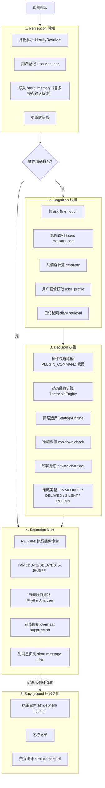

# 引擎架构

EmotionalGroupChatEngine 是 Sirius Pulse 的核心，负责从消息输入到回复输出的完整处理链路。

## 组合模式架构

引擎通过**组合模式**集成多个组件，所有组件通过 `engine._xxx` 属性访问：

```python
class EmotionalGroupChatEngine(_EmotionalGroupChatEngineBase):
    """组合模式最终类，所有组件已集成到基类中。"""
    pass

# 组件访问示例
engine._pipeline           # Pipeline: 5 阶段管线
engine._helpers            # Helpers: 技能集成、工具方法
engine._persistence        # EnginePersistence: 状态持久化
engine._sticker            # EngineSticker: 表情包系统
engine._sticker_oppositions # dict[str, list[str]]: 表情包二元对立缓存（如 {"开心": ["难过", "伤心"]}）
engine._evolution_chain    # EvolutionChain: 演化链（含别称管理）
engine._identity_resolver  # IdentityResolver: 身份解析（含别名/模糊匹配）
engine._biography_view     # BiographyView: 传记视图，实时计算用户传记
engine._bot_platform_uids  # dict[str,str]: Bot 在各平台的 UID
engine._slice_store        # DiarySliceStore: 日记切片文件持久化
engine._slice_vector_store # DiarySliceVectorStore: 日记切片 ChromaDB 向量存储
```

## 5 阶段管线

每条消息经过完整的 5 阶段处理：



> **插件命令快速拦截**：在感知阶段完成后，引擎会立即检查消息是否为已注册的插件精确命令（如 `/analyse`）。如果是，则直接跳转到执行阶段的插件执行流程（E），不再进行后续的认知分析和决策，实现零 LLM 成本的快速响应。

## 核心子系统

### 认知分析器（CognitionAnalyzer）

联合分析情绪和意图。输入最近 N 条历史消息 + 当前消息，输出 `IntentAnalysisV3` + `EmotionState`。`IntentAnalysisV3` 包含 `sticker_caption`（动画表情缓存描述）和 `image_caption`（普通图片描述）字段。在回写 basic_memory 时，引擎优先使用 `sticker_caption`（如果存在）；对于动画表情消息，会移除无意义的文件哈希，替换为 `【动画表情：caption】` 格式；对于普通图片则使用 `【图片】【图片描述：caption】` 格式。如果所有图片（包括缓存的动画表情）都已解析且没有需要首次分析的多模态项目，则跳过 LLM 调用，直接使用规则分析。

认知分析器集成了传记系统的用户别名数据，当群聊中存在用户别称映射时（如 `"小明" → 张三`），会将这些信息注入 LLM prompt，帮助模型区分 AI 自身的别名和其他用户的别称，从而更准确地计算 `directed_score`（消息指向 AI 的程度）。

在管线感知阶段，管道会调用 `_collect_biography_section` 收集当前消息的人物传记上下文，返回一个 `BiographyPromptContext` 对象（包含 `speaker_card`、`mentioned_cards`、`confidence` 字段）。该对象被传递给延迟响应队列，在队列项合并时自动合并多个消息的传记上下文，确保后续 prompt 组装使用最新的传记信息，避免了跨消息的共享状态。

### 阈值引擎（ThresholdEngine）

动态计算回复阈值，考虑因素：

- 灵敏度设置（sensitivity）
- 群聊热度（heat）
- 消息速率（message_rate）
- 传记亲和力（biography affinity）
- 人格回复频率偏置

### 身份解析器（IdentityResolver）

群聊消息到达后，引擎首先通过 `IdentityResolver` 对消息发言者进行身份解析。解析器支持四级解析链：

| 层级 | 方式 | 置信度 | 说明 |
|------|------|--------|------|
| L1 | platform_id 精确匹配 | 1.0 | 通过平台用户 ID 直接匹配已注册用户 |
| L1.5 | Bot 自身检测 | 1.0 | 检测消息是否来自 Bot 自身账号（基于 `_bot_platform_uids`） |
| L2 | evolution_chain 别称缓存精确匹配 | 0.9 | 通过演化链的别称缓存精确匹配 |
| L3 | 模糊匹配 | 0.7~0.9 | 基于模糊字符串匹配（如相似度>0.85） |
| L4 | 上下文推断 | 0.6 | 根据最近发言者列表推断身份 |

每个解析结果都包含 `user_id`、`confidence`（置信度）和 `source`（解析来源），供后续认知分析、决策等阶段参考。

### 消息前缀过滤（MessagePrefixFilter）

根据配置的 `message_prefixes` 列表，在决策阶段对消息内容进行前缀匹配。若消息以任一前缀开头（去除前导空格后），则直接跳过回复流程，返回 `SILENT` 策略。此过滤发生在阈值计算之后、策略选择之前，不会影响已匹配的插件命令。

配置示例：
```json
{
  "message_prefixes": ["#", "!"]
}
```

### 策略引擎（ResponseStrategyEngine）

根据阈值和意图选择策略：
- **IMMEDIATE**: 直接回复
- **DELAYED**: 延迟回复（等待确认窗口）
- **SILENT**: 不回复
- **PLUGIN**: 执行插件命令

### 节奏分析器（RhythmAnalyzer）

监控群聊节奏，检测：
- **加速中**（accelerating）：活跃讨论
- **平稳**（steady）：正常节奏
- **减速中**（decelerating）：话题冷却
- **沉默**（silent）：无人发言

### 延迟响应队列（DelayedResponseQueue）

非立即回复进入延迟队列，在确认窗口后释放。支持队列合并（连续发送多条消息时合并为一条回复）。

每个队列项携带一个 `biography_context` 字段（`BiographyPromptContext` 类型），用于存储该消息的人物传记快照。当多条消息合并时，队列会自动合并各自的传记上下文：`speaker_card` 取后覆盖、`mentioned_cards` 拼接去重、`confidence` 取最大值。合并后的传记上下文在释放回复时传递给 prompt 工厂，确保模型能感知到当前消息涉及的人物关系。

## Brain 系统

Brain 是引擎的 LLM 调用层，支持：

- **任务路由**: 根据 task_name（response_generate, cognition_analyze, proactive_generate）选择合适的模型
- **Post-Hooks 链**: 回复生成后的后置处理，按优先级执行：

| 优先级 | Hook | 功能 |
|--------|------|------|
| 0 | `_hook_depth` | 对话深度追踪 |
| 10 | `_hook_reply_reference` | 模型输出中 `[REPLY:xxx]` 引用回复指令解析，将引用信息存储到 `ChatResult.reply_references` 供适配器层使用（从 basic_memory 获取最近非 assistant 消息建立索引映射） |
| 20 | `_hook_stickers` | 表情包发送（使用 `_pick_sticker_choice` 从模型选择列表中随机选一个并匹配实际文件） |
| 30 | `_hook_dedup` | 回复去重（仅聊天回复，主动行为不触发） |
| 40 | `_hook_memory` | 记忆记录（basic + semantic），写入模型输出相关标签 |
| 50 | `_hook_timestamp` | 回复时间戳 + 持久化 |

> 回复生成的 `ChatResult` 对象包含 `system_prompt` 字段（存储本次对话使用的完整 system prompt）和 `reply_references` 字段（存储引用回复信息，由 `_hook_reply_reference` 填充），这些字段后续会被写入 basic_store 的 entry 中。

## 后台任务

引擎运行 7 个后台异步任务：

| 任务 | 间隔 | 功能 |
|------|------|------|
| 延迟响应轮询 | 1s | 释放到期延迟回复 |
| 主动行为评估 | 可变 | 评估是否需要主动发起对话 |
| 日记促进与精炼 | 可变 | 群聊沉寂后归档对话，结合冷检测、情景提取和演化链精炼；传递 storage 和 user_manager 实例加载群组别名映射及用户信息，提升情景提取准确性；从候选消息中过滤已生成日记或已提取情景的消息；切片会记录关联的情景ID（situation_ids）；在COLD状态下优先使用未处理的情景生成日记，支持情景补提；生成的切片会持久化到文件并索引到 ChromaDB 向量库，成功后标记情景为已处理 |
| 后台精炼 | 可变 | 对已完成的日记切片进行二次精炼，提取情景和演化事实；传递 storage 实例以利用别名映射 |
| 记忆维护 | 可变 | 语义记忆整理和衰减 |
| 状态持久化 | 300s | 全量保存运行时状态 |
| 提醒检查 | 10s | 到期提醒分发（来自 reminder skill） |
| 表情包缓存预热 | 启动后一次 | 异步预热表情包二元对立缓存（基于词表调用 LLM 生成对立关系，持久化到 `engine_state/sticker_oppositions.json`） |

## 配置热重载

引擎支持通过标志文件热重载以下配置类型：

| 重载类型 | 说明 |
|---------|------|
| `persona` | 人格配置（包括提示词、角色设定等） |
| `orchestration` | 编排配置（模型路由、LLM 参数等） |
| `experience` | 经验配置（情感、记忆等） |
| `provider` | 提供商配置（provider_keys.json 中的模型列表、API key 等） |
| `all` | 全部重载 |

当 WebUI 中修改并保存 `provider_keys.json` 或开发者调用 `refresh_models_from_dev` 时，系统会自动向所有运行中的人格写入 `provider` 重载标志，由 PersonaWorker 的后台循环读取并执行热重载，无需重启引擎。

> **模型选择复合标识**：自 2.0 版本起，WebUI 中模型下拉选项的 `value` 使用 `{provider_type}/{model_name}` 复合格式，以区分来自不同提供商但同名的模型。保存时前端会自动剥离前缀仅保留裸模型名，引擎仍使用裸模型名调用 API。可用模型列表（`available_models`）维护去重后的裸模型名集合。

## 记忆持久化

引擎在以下时机进行持久化：
- 每次回复后（单群状态）
- 定期全量保存（300 秒间隔）
- 引擎停止时

持久化内容包括：basic_memory、basic_store、时间戳、emotion、delay_queue、token_usage、diary、proactive_state。

### 用户消息持久化（感知阶段）

当消息到达时，Pipeline 在感知阶段将消息写入 basic_memory，同时生成多模态输入标签（区分动画表情和普通图片）并附加到 entry.tags，然后将 entry 追加到 basic_store。

### AI 回复持久化（执行阶段）

生成回复后，引擎通过 `_hook_memory` 将回复写入 basic_memory，同时将 entry 对象（包含 `system_prompt`、`tags`、`conversation_chain` 字段，字段值仅记录模型输出相关标签，如表情包、钉住指令）追加到 basic_store，用于后续的快速检索和同步。

- `system_prompt`: 本次 LLM 调用使用的完整 system prompt
- `tags`: 模型输出相关标签（表情包名称）
- `conversation_chain`: 完整的 LLM 消息链，包含 system prompt 和用户消息（user/assistant 交替），用于上下文回溯和 prompt 重建

> 注意：用户消息的 entry 包含多模态输入标签（图片、动画表情数量），而 AI 回复的 entry 包含模型输出相关标签（表情包名称）和完整的 LLM 消息链。两部分共同形成完整的对话 tagging。

详见 [记忆系统](./memory-system)。
