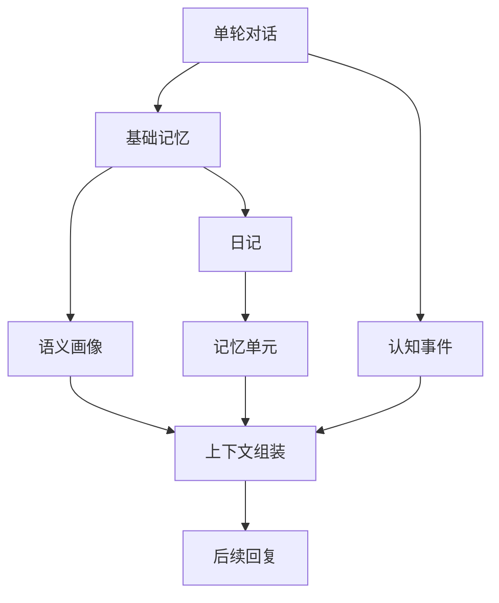

# 记忆演化

记忆演化指 Sirius Pulse 将即时对话逐步沉淀为稳定上下文的过程。

```mermaid
flowchart TD
  Turn["单轮对话"] --> Basic["基础记忆"]
  Turn --> Cognition["认知事件"]
  Basic --> Semantic["语义画像"]
  Basic --> Diary["日记"]
  Diary --> Units["记忆单元"]
  Semantic --> Context["上下文组装"]
  Units --> Context
  Cognition --> Context
  Context --> Reply["后续回复"]
```

## 设计原则

- 短期内容优先保留原文和时间顺序。
- 长期内容优先结构化、摘要化、可检索。
- 用户相关事实进入用户档案或语义画像。
- 群体氛围和关系变化进入群级语义画像。
- 专有名词和约定进入术语表。
