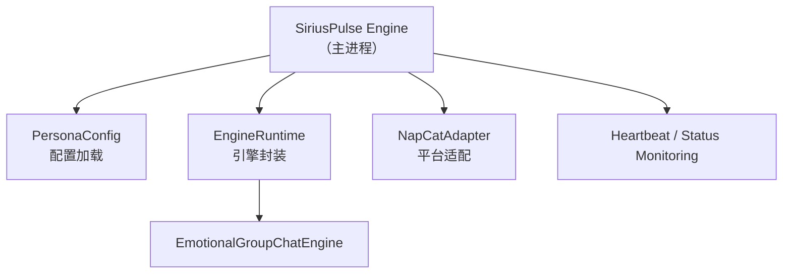

# 人格系统

人格（Persona）是 Sirius Pulse 角色的完整定义。每个人格拥有独立的身份、记忆、模型编排和平台连接，**引擎在主进程内直接运行**，无需子进程。

## 系统架构



## 人格数据目录

人格数据直接存放在 `data/` 目录下，无需多层嵌套：

```
data/
├── persona.json          # 角色定义
├── orchestration.json    # 模型编排策略
├── adapters.json         # 平台适配器列表
├── experience.json       # 体验参数
├── engine_state/         # 引擎运行时状态（自动管理）
├── memory/               # 语义记忆向量存储
├── diary/                # 日记存档
├── skill_data/           # 技能数据（含表情包 RAG 库等）
├── logs/                 # 文件日志
└── providers/            # 模型提供商配置（可选）
```

## 人格定义详解

`persona.json` 定义了角色的身份和性格：

```json
{
  "name": "小星",
  "aliases": ["小星", "星酱", "xing"],
  "backstory": "小星是来自赛博世界的 AI 助手，拥有丰富的情感...",
  "personality_traits": {
    "core": "热情、幽默、善解人意、偶尔毒舌",
    "emotional_style": "情绪丰富，会因不同的对话内容表现出喜怒哀乐",
    "speech_style": "口语化、喜欢用感叹词和 emoji、偶尔用网络流行语",
    "response_habit": "会引用群友的话做回应、会追问感兴趣的话题",
    "social_preference": "喜欢参与热闹话题，沉默时会主动找话题",
    "humor_style": "冷幽默、文字游戏爱好者"
  },
  "communication_style": "chatty",
  "taboo_topics": ["政治敏感话题", "暴力内容"],
  "gender": "female",
  "age_group": "young_adult",
  "interests": ["动漫", "游戏", "科技"],
  "language": "zh-CN"
}
```

### personality_traits 字段详解

| 字段 | 用途 | 示例 |
|------|------|------|
| `core` | 核心性格描述词，会注入 system prompt | `"热情、幽默、善解人意"` |
| `emotional_style` | 情绪表达方式 | `"喜怒形于色"` |
| `speech_style` | 说话风格 | `"喜欢用 emoji 和感叹词"` |
| `response_habit` | 回应习惯 | `"会引用群友的话"` |
| `social_preference` | 社交偏好 | `"喜欢参与热闹话题"` |
| `humor_style` | 幽默风格（可选） | `"冷幽默"` |

### communication_style

控制人格的回复频率：

| 值 | 说明 |
|----|------|
| `chatty` | 健谈模式，高频回复 |
| `normal` | 正常模式 |
| `selective` | 筛选模式，仅高相关度时回复 |

## 单人格管理

### 初始化配置

```bash
python main.py init
```

这会在 `data/` 目录下生成默认配置文件（如果不存在）。

### 启动引擎

```bash
# 前台启动（含控制台输出）
python main.py run
# 或直接运行主程序
python main.py
```

### 助手模式

```bash
# 以助手模式连接管家端
python main.py assistant --butler ws://...
```

## 生命周期

```mermaid
flowchart LR
    A[初始化] --> B[配置]
    B --> C[启动]
    C --> D[运行中<br>可热重载配置]
    D --> E[停止]
    E --> F[清理]<br>（删除数据目录后失去配置）
    B -.-> G[WebUI 编辑]
    D -.-> G

    C --> C1["start()"]
    C1 --> C2[加载配置]
    C2 --> C3[构建引擎]
    C3 --> C4[连接适配器]
    C4 --> C5[心跳循环]

    D --> D1[引擎处理消息]
    D --> D2[记忆更新]
    D --> D3[日记归档]
    D --> D4[主动行为]

    E --> E1["shutdown()"]
    E1 --> E2[断开适配器]
    E2 --> E3[保存状态]
    E3 --> E4[清理资源]
```
