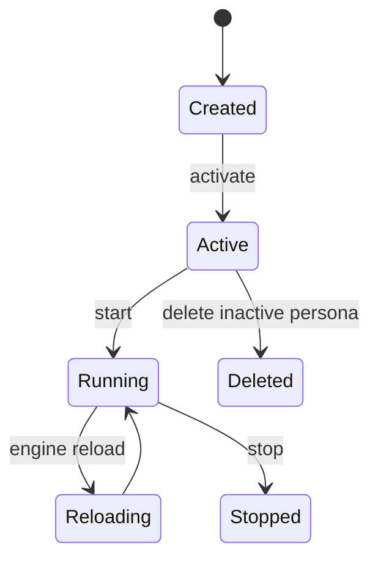

# 人格系统

人格是 Sirius Pulse 的运行单元。每个人格有独立配置、记忆、平台适配器、日志和运行状态。

## 生命周期



## CLI 管理

```bash
python main.py persona list
python main.py persona create <name>
python main.py persona activate <name>
python main.py persona delete <name> --force
```

## WebUI 管理 API

| 方法 | 路径 | 说明 |
|---|---|---|
| `GET` | `/api/personas` | 列出人格。 |
| `POST` | `/api/personas` | 创建人格。 |
| `GET` | `/api/personas/active` | 当前活跃人格。 |
| `POST` | `/api/personas/{name}/activate` | 切换活跃人格。 |
| `DELETE` | `/api/personas/{name}` | 删除人格。 |
| `POST` | `/api/persona/start` | 启动当前人格。 |
| `POST` | `/api/persona/stop` | 停止当前人格。 |
| `GET` | `/api/persona/status` | 查看当前人格运行状态。 |
