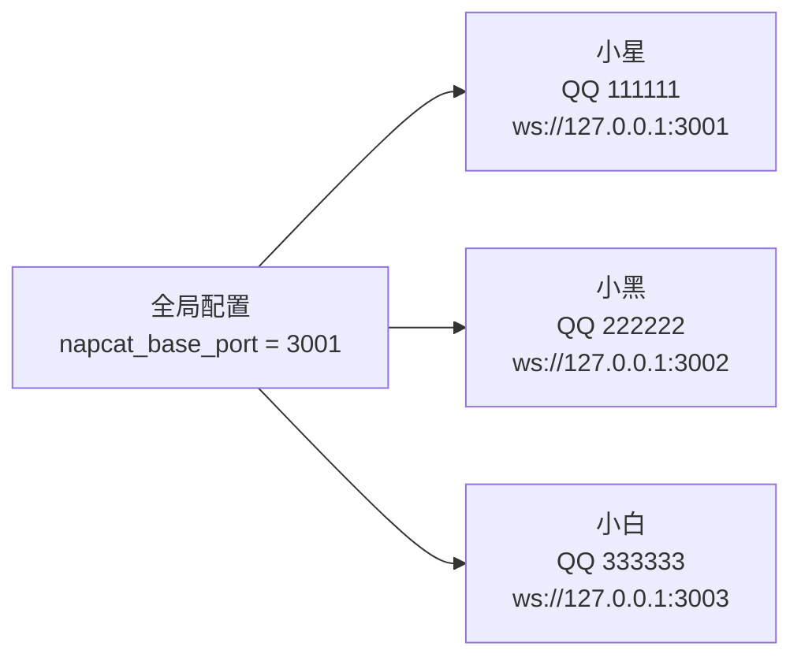

# NapCat / OneBot 接入

Sirius Pulse 通过 NapCat 适配器接入 QQ 平台，使用 OneBot v11 标准协议。

## NapCat 简介

NapCat 是基于 QQ NT 内核的无头客户端，提供 WebSocket 接口，兼容 OneBot v11 协议。

Sirius Pulse 内置了 NapCat 管理器，可以：
- 自动下载和安装 NapCat
- 多人格独立实例管理
- 通过 WebUI 可视化配置

## 接入流程

### 1. WebUI 配置

访问 `http://localhost:8080` → NapCat 页面：

1. 设置 **NapCat 路径**（如 `D:\napcat`）
2. 设置 **QQ 号** 和 **ws_token**
3. 点击 **安装/更新 NapCat**
4. 点击 **启动**
5. 扫码登录

### 2. 为格添加适配器

在 "适配器" 页面，为目标人格添加 NapCat 适配器：

```json
{
  "type": "napcat",
  "ws_url": "ws://127.0.0.1:3001",
  "qq": 123456789,
  "ws_token": "your-token",
  "group_whitelist": [],
  "private_whitelist": [],
  "peer_ai_ids": []
}
```

### 3. 白名单配置

| 字段 | 说明 |
|------|------|
| `group_whitelist` | 群聊白名单，为空表示不限制 |
| `private_whitelist` | 私聊白名单，为空表示不限制 |

不设置白名单时，所有群和私聊都会响应。

### 4. 多 AI 共存

`peer_ai_ids` 用于标识同一群中其他 AI 账号。引擎会识别它们的发言，避免互相回复形成循环。

系统会自动扫描其他人格的 QQ 号填入此字段。

## 多人格端口管理

每人格需要独立的 NapCat 实例和端口：



## 协议支持

基于 OneBot v11 WebSocket 协议：

### 接收事件

| 事件 | 说明 |
|------|------|
| `message.group` | 群聊消息 |
| `message.private` | 私聊消息 |
| `notice.group_increase` | 新成员入群 |

#### 引用消息（回复）

当收到包含 `reply` 消息段的消息时（即用户回复了某条消息），NapCat 适配器会自动调用 `get_msg` API 获取被引用消息的文本内容和发送者，并将引用信息作为 `reply_references` 传递给引擎。引擎在生成回复时会携带这些引用信息，适配器根据引用信息自动构建回复消息：如果有有效的 `msg_id`，则使用 OneBot 的 `reply` 消息段进行引用回复；否则以文本格式添加引用内容。

这使得 AI 能够理解消息的引用关系，做出更准确的回复。当回复中包含引用标记时，NapCat 适配器会将其转换为 OneBot 的 `reply` 消息段，实现客户端中的引用效果。

#### @ 提及（At）

当模型回复中包含 `@{QQ号}` 标记时（如 `@123456`），适配器会自动将其转换为 OneBot 的 `at` 消息段，实现 @ 功能。模型也可以使用 `@昵称` 或 `@群名片` 来提及成员，适配器会基于群成员缓存自动转换为 `@{QQ号}` 格式。

支持以下 @ 格式：
- `@123456`：直接 @ 指定 QQ 号的成员（仅限该群内的合法 QQ 号）
- `@昵称或群名片`：通过名称匹配对应的 QQ 号

注意：模型不应编造 QQ 号，应从上下文消息中获取真实发送者的 QQ 号。

### 发送动作

| API | 说明 |
|-----|------|
| `send_group_msg` | 发送群消息 |
| `send_private_msg` | 发送私聊消息 |
| `send_group_forward_msg` | 发送合并转发消息 |
| `upload_group_file` | 上传群文件 |
| `get_group_member_info` | 获取群成员信息 |

## 手动启动

除了 WebUI，也可以通过命令行管理：

```bash
# 安装 NapCat
sirius-pulse napcat install --path D:\napcat

# 启动实例
sirius-pulse napcat start --qq 123456 --port 3001

# 查看状态
sirius-pulse napcat status
```

## 常见问题

### Q: 扫码后一直显示"等待登录"

- 检查 QQ 号是否正确
- 确保 NapCat 版本与 QQ NT 版本匹配
- 尝试重新安装 NapCat

### Q: WS 连接失败

- 检查 ws_url 端口是否正确
- 确保 NapCat 实例已启动
- 检查防火墙设置

### Q: 多个人格共用一个 QQ 号？

不支持。每个人格需要独立的 QQ 号（和独立的 NapCat 实例）。
